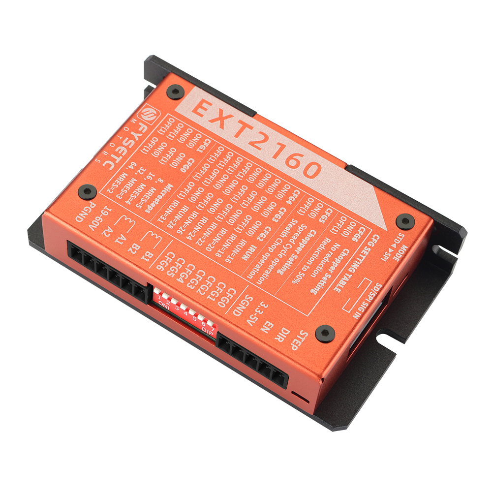

# EXT2160

## Introduction

The EXT2160 is a high-performance driver designed based on the Trinamic TMC2160 chip. It can provide smooth and low-noise drive capability, and can detect the motor running status in real time. It has a stall detection function to achieve sensor-less homing. With high-performance MOSFET, the maximum peak current can reach 6.6A in default, and by replacing the Rs, The current can further reach 15A peak value.

The driver can be controlled using simple pulse/direction/enable signals, work in stand-alone mode, or can be controlled with SPI for more intelligent applications. All signal interfaces are equipped with digital isolators up to 3750V to avoid irreversible damage to the controller due to high voltage and directional electromotive force.

The driver can be used in any occasion using a stepper motor, and comes with a StepStick adapter board, which is easy to install on 3D printers that require high voltage and high current drive.

## Feature

- Based on TMC2160
- Extra small size: 96x57x21
- 19-60V wide voltage support
- High-performance MOSFET, default maximum peak current 6.6A, replacement Rs can reach 15A peak (need to change the connection method)
- Standalone mode, Step/Dir interface, with MicroPlyer™ subdivision compensation for 256 microsteps
- Support SPI mode, work perfectly with firmware such as Marlin/Klipper
- high precision sensorless motor load detection / current control for energy savings up to 75% / quiet operation and smooth motion
- Onboard 3750V digital isolation
- StepStick adapter board optional, SPI direct drive
- Aluminum shell, taking into account both beauty and heat dissipation
- 2x5 DC3 connector, including SPI and S/D
- 1x7 DIP selector switch for Standalone mode， current regulation and function configuration
